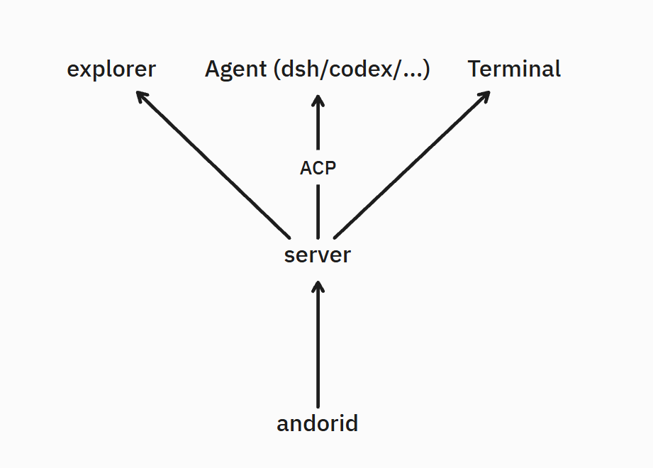

# Yet Another Mobile IDE

yamide (yet another mobile IDE)，可以远程通过 **安卓手机** 在你的 **linux** 上工作，提供资源管理器，agent（通过ACP），以及一个可以让AI帮你写命令的终端。

本项目承诺每一行代码都经过人工 review.

预期架构如下



## 当前项目结构

- `apps/server`：Nest.js 服务端，提供 API、会话和工作区能力的基础入口。
- `apps/client`：Vue 3 + Capacitor 客户端，当前目标平台为 Web 和 Android。
- `docs`：项目架构和设计文档。

## 开发

```bash
pnpm install
pnpm dev
```

服务端默认监听 `http://localhost:3000`，前端默认监听 `http://localhost:5173`。

移动端原生工程按需生成：

```bash
pnpm --filter @yamide/client cap:add:android
pnpm cap:sync
```
